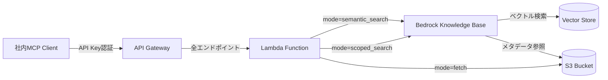

# repo-bridge-mcp-infra

## 概要

repo-bridge-mcpの裏側インフラとして、API Gateway + Lambda + Bedrock KB + S3で構成するMCP専用RAG基盤を管理するリポジトリ。
API Key制御で社内MCPからのみアクセス可能な検索・原本取得APIを提供する。
global/scope検索と全文取得（S3）を分離したハイブリッドRAG構成。

## アーキテクチャ



## 主要機能

| 機能ID | 機能名 | 説明 |
| ------ | ------ | ---- |
| F-001 | 意味検索（semantic_search） | Bedrock KBを使用した全体意味検索 |
| F-002 | スコープ限定検索（scoped_search） | メタデータフィルタ + Bedrock KBによる検索 |
| F-003 | 全文取得（fetch） | S3から原本ドキュメント全文を取得 |
| F-004 | APIキー認証 | API Gateway usage planによる認証 |

## 技術スタック

- **IaC**: Terraform
- **Lambda Runtime**: Python 3.12
- **API Gateway**: REST API（APIキー認証）
- **RAG基盤**: Amazon Bedrock Knowledge Base
- **ストレージ**: Amazon S3
- **リージョン**: ap-northeast-1（東京）

## セットアップ

### 前提条件

- AWS CLI設定済み
- Terraform 1.5+インストール済み
- Python 3.12+インストール済み
- Bedrockモデルアクセス権限が有効
- Terraformバックエンド（S3 + DynamoDB）が構成済み

### インフラデプロイ

```bash
# 1. Terraform初期化（バックエンド設定）
cd infra
terraform init \
  -backend-config="bucket=<tfstate-bucket>" \
  -backend-config="key=repo-bridge-mcp-infra/terraform.tfstate" \
  -backend-config="region=ap-northeast-1" \
  -backend-config="dynamodb_table=<lock-table>"

# 2. Lambda placeholder作成（Windowsの場合）
mkdir tmp
echo 'def lambda_handler(event, context): return {"statusCode": 200, "body": "Placeholder"}' > tmp/main.py
cd tmp && powershell -Command "Compress-Archive -Path main.py -DestinationPath ../lambda_placeholder.zip -Force"
cd .. && rm -rf tmp

# 3. 実行計画確認
terraform plan

# 4. インフラデプロイ
terraform apply

# 5. API Key設定（デプロイ後）
API_KEY=$(terraform output -raw api_gateway_api_key_value)
aws ssm put-parameter \
  --name "/repo-bridge-mcp-infra/dev/api-key" \
  --value "$API_KEY" \
  --type SecureString \
  --overwrite

# 6. Aurora pgvector有効化
CLUSTER_ENDPOINT=$(terraform output -raw aurora_cluster_endpoint)
psql -h $CLUSTER_ENDPOINT -U postgres -d knowledge_base -c "CREATE EXTENSION IF NOT EXISTS vector;"
```

### Lambda関数テスト

```bash
# 依存パッケージインストール
cd lambda && pip install -r requirements.txt

# テスト実行
pytest lambda/tests/
```

## API仕様

詳細なAPI仕様は [docs/design.md](docs/design.md) を参照。

### エンドポイント

- **POST** `/rag/query` - 統合エンドポイント（modeパラメータで分岐）

### modeパラメータ

- `semantic_search`: 意味検索（global、Bedrock KB使用）
- `scoped_search`: スコープ限定検索（メタデータ絞り込み + KB併用）
- `fetch`: 全文取得（S3 GetObject）

## ディレクトリ構成

| ディレクトリ | 説明 |
| -- | -- |
| .claude/ | Claude Code設定・ルール・スキル |
| .context/ | コンテキストファイル配置場所 |
| docs/ | 設計ドキュメント（design.md等） |
| infra/ | Terraformインフラコード |
| lambda/ | Lambda関数ソースコード |

## ライセンス

非公開プロジェクト（社内利用のみ）
