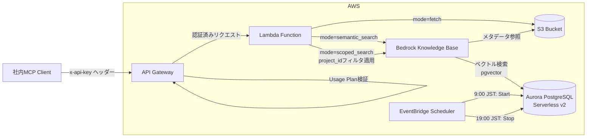
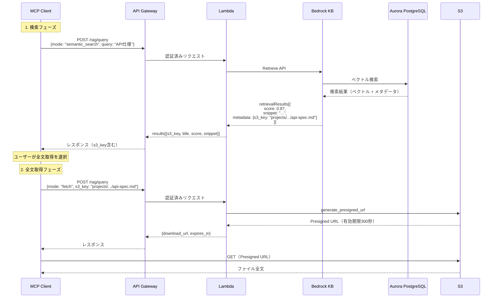
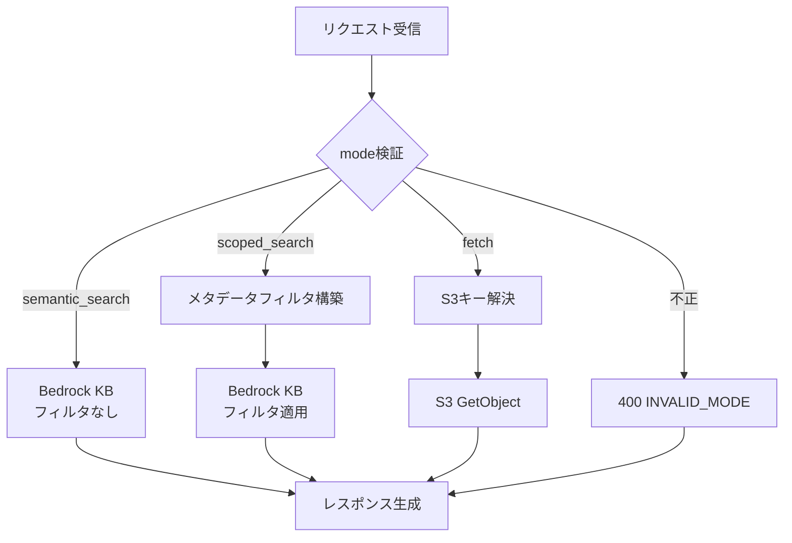
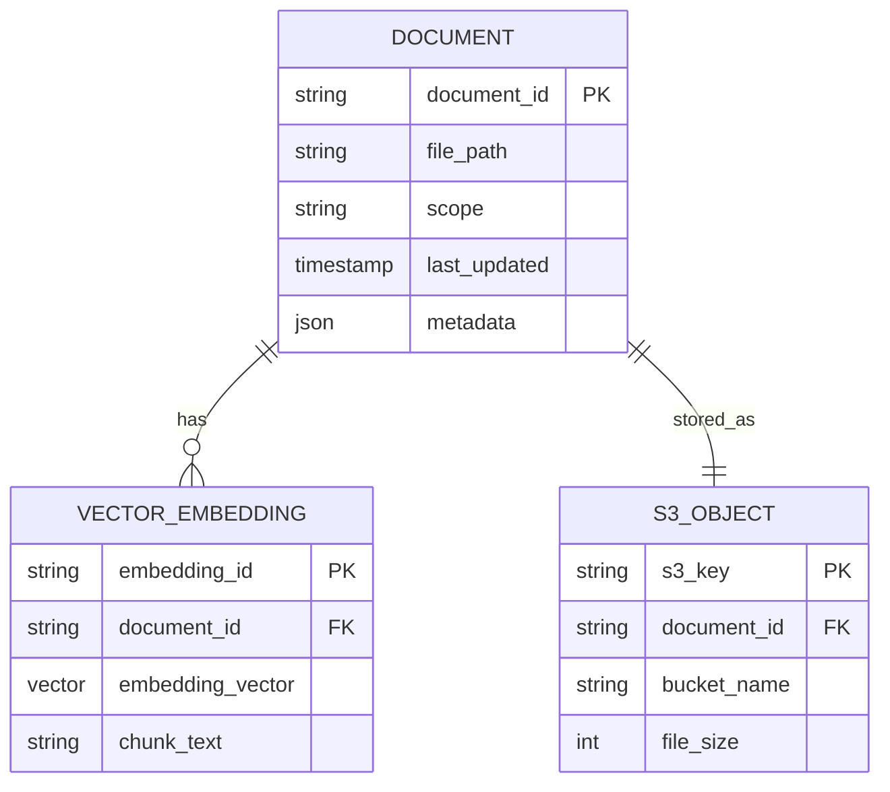
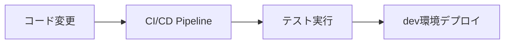

# design.md

## 1. 概要（Overview）

repo-bridge-mcpの裏側インフラとして、Bedrock Knowledge BaseとS3を活用したハイブリッドRAG基盤を提供する。
API Gateway + Lambdaで構成し、APIキー認証により社内MCPからのみアクセス可能なRAG検索・原本取得APIを提供する。
global/scope検索の2種類のRAG検索と、S3からの全文取得を分離することで、効率的な情報検索を実現する。

---

## 2. アーキテクチャ設計



### コンポーネント構成

| コンポーネント         | 役割                                       | 技術仕様                                                      |
|------------------------|--------------------------------------------|-----------------------------------------------------------------|
| API Gateway            | APIキー認証・エンドポイント管理           | REST API、Usage Plan認証                                        |
| Lambda Function        | 統合ハンドラ（検索/取得を内部で条件分岐） | Python 3.12、リクエストコンテキスト経由で認証情報取得          |
| Bedrock Knowledge Base | RAG検索エンジン                            | マネージドサービス、埋め込みモデル: Titan Embeddings v2        |
| Aurora PostgreSQL      | ベクトルデータストア                       | Serverless v2（0.5〜1 ACU）、pgvectorエクステンション          |
| S3 Bucket              | ドキュメント原本ストレージ                 | Standard class、メタデータJSON併置                              |
| EventBridge Scheduler  | Aurora定期起動・停止（コスト削減目的）     | cron式でAuroraを9:00起動、19:00停止（開発環境のみ）             |

### 認証フロー

1. MCPクライアントが`x-api-key`ヘッダーにAPIキーを付与してリクエスト
2. API GatewayがUsage Planでキー検証（無効なキーは403 Forbiddenで即座に拒否）
3. 認証成功時、API Gatewayがリクエストコンテキスト（`event['requestContext']`）にAPIキー情報を付与
4. Lambdaはリクエストコンテキスト経由で認証済みであることを確認（追加検証不要）

### データの流れ

#### 検索フロー

1. **意味検索フロー（semantic_search）**: MCP → API Gateway（認証） → Lambda（mode判定） → Bedrock KB → Aurora（ベクトル検索） → レスポンス（s3_key含む）
1. **スコープ限定検索フロー（scoped_search）**: MCP → API Gateway（認証） → Lambda（mode判定 + project_idフィルタ） → Bedrock KB → Aurora（WHERE project_id + ベクトル検索） → レスポンス（s3_key含む）

#### 全文取得フロー

1. **全文取得フロー（fetch）**:
   - MCP → API Gateway（認証） → Lambda（mode判定） → S3 Presigned URL生成（有効期限300秒） → URL返却
   - MCP → S3（Presigned URL直接アクセス） → ファイルダウンロード

#### 検索→全文取得の2段階フロー



**重要**: 検索結果のレスポンスに含まれる`s3_key`を使用してfetchリクエストを発行する。MCPクライアント側でs3_keyを生成・推測してはならない。

---

## 3. 機能一覧

| 機能ID | 機能名 | 優先度 | 概要 |
|--------|--------|--------|------|
| F-001 | 意味検索（semantic_search） | 高 | Bedrock KBを使用した全体意味検索 |
| F-002 | スコープ限定検索（scoped_search） | 高 | メタデータフィルタ + Bedrock KBによる検索 |
| F-003 | 全文取得（fetch） | 高 | S3から原本ドキュメント全文を取得 |
| F-004 | APIキー認証 | 高 | API Gateway usage planによる認証 |
| F-005 | メタデータ管理 | 中 | project_id/type/system/tagsによる分類 |

---

## 4. API設計

### 4.1 エンドポイント一覧

| メソッド | パス | 概要 |
|---------|------|------|
| POST | `/rag/query` | 統合エンドポイント（modeパラメータで分岐） |

**modeパラメータ**:
- `semantic_search`: 意味検索（global、Bedrock KB使用）
- `scoped_search`: スコープ限定検索（メタデータ絞り込み + KB併用）
- `fetch`: 全文取得（S3 GetObject）

### 4.2 認証方式

- **APIキー認証**: `x-api-key`ヘッダーによるAPI Gateway usage plan認証
- 社内MCP専用のAPIキーを発行

### 4.3 リクエストIF（共通形式）

#### 基本形

```json
{
  "mode": "semantic_search | scoped_search | fetch",
  "query": "検索クエリ文字列（modeがfetchの場合は不要）",
  "s3_key": "S3オブジェクトキー（modeがfetchの場合のみ必須。検索レスポンスのresults[].s3_keyから取得）",
  "scope": {
    "project_id": "プロジェクトID（scoped_searchの場合のみ必須）"
  },
  "options": {
    "top_k": 5,
    "include_content": false
  }
}
```

**重要**: `s3_key`は検索結果（semantic_search/scoped_search）のレスポンスから取得したものを使用する。クライアント側でパスを生成・推測してはならない。

### 4.4 各モード詳細

#### 4.4.1 semantic_search（意味検索）

**用途**: 全プロジェクト横断で意味的に類似したドキュメントを検索

**リクエスト例**:
```json
{
  "mode": "semantic_search",
  "query": "似た案件のAPI仕様はある？",
  "options": {
    "top_k": 5
  }
}
```

**処理フロー**: Lambda → Bedrock KB（プロジェクトフィルタなし）

**レスポンス（200 OK）**:
```json
{
  "mode": "semantic_search",
  "results": [
    {
      "s3_key": "projects/billing-system/docs/spec/v2/api-spec.md",
      "title": "API仕様書 v1.2",
      "score": 0.87,
      "snippet": "...検索結果の抜粋テキスト...",
      "metadata": {
        "project_id": "billing-system",
        "file_name": "api-spec.md",
        "format": "markdown",
        "size": 10240,
        "last_updated": "2026-04-28T12:00:00Z"
      }
    }
  ],
  "source": "bedrock",
  "metadata": {
    "total": 12,
    "query_time_ms": 234
  }
}
```

**レスポンスフィールド説明**:

| フィールド | 型 | 説明 |
| ---------- | -- | ---- |
| results[].s3_key | string | S3オブジェクトキー。**全文取得（fetch）リクエスト時にこの値を使用** |
| results[].title | string | ドキュメントタイトル |
| results[].score | float | 類似度スコア（0.0〜1.0） |
| results[].snippet | string | 検索結果の抜粋テキスト（チャンク） |
| results[].metadata | object | ドキュメントメタデータ |
| source | string | 検索元（固定値: "bedrock"） |
| metadata.total | int | 総検索結果件数 |
| metadata.query_time_ms | int | クエリ実行時間（ミリ秒） |

#### 4.4.2 scoped_search（スコープ限定検索）

**用途**: 特定プロジェクト内のドキュメントを検索

**リクエスト例**:
```json
{
  "mode": "scoped_search",
  "query": "IF仕様書",
  "scope": {
    "project_id": "billing-system"
  },
  "options": {
    "top_k": 5
  }
}
```

**処理フロー**: Lambda → project_idフィルタ適用 → Bedrock KB

**レスポンス（200 OK）**: semantic_searchと同一形式

#### 4.4.3 fetch（全文取得）

**用途**: ドキュメント全文をS3から取得

**前提**: semantic_search/scoped_searchのレスポンスから`s3_key`を取得済み

**リクエスト例**:
```json
{
  "mode": "fetch",
  "s3_key": "projects/billing-system/docs/spec/v2/api-spec.md"
}
```

**処理フロー**: Lambda → S3 Presigned URL生成（有効期限300秒）

**レスポンス（200 OK）**:
```json
{
  "mode": "fetch",
  "s3_key": "projects/billing-system/docs/spec/v2/api-spec.md",
  "download_url": "https://bucket-name.s3.ap-northeast-1.amazonaws.com/path/to/api-spec.md?X-Amz-Algorithm=AWS4-HMAC-SHA256&X-Amz-Credential=...&X-Amz-Signature=...",
  "expires_in": 300,
  "metadata": {
    "title": "API仕様書 v1.2",
    "project_id": "billing-system",
    "format": "markdown",
    "size": 10240,
    "last_updated": "2026-04-28T12:00:00Z"
  }
}
```

**レスポンスフィールド説明**:

- `download_url`: S3 Presigned URL（署名付き、5分間有効）
- `expires_in`: URL有効期限（秒、デフォルト300秒）
- `metadata.format`: ファイル形式（markdown/txt/pdf等）

### 4.5 scope設計（メタデータ構造）

**scopeオブジェクトの構造**:

```json
{
  "project_id": "billing-system"
}
```

**フィールド仕様**:

| フィールド | 型 | 必須 | 説明 | 例 |
|-----------|-----|-----|------|-----|
| project_id | string | Yes（scoped_searchのみ） | プロジェクト識別子 | "billing-system", "auth-platform" |

**scoped_searchの用途**:

- 特定プロジェクト内のドキュメントに検索範囲を限定
- プロジェクト横断検索は`semantic_search`を使用
- Bedrock KBのメタデータフィルタリング機能（`project_id`のみ）を活用

### 4.6 Lambda内部ルーティングルール

```python
if mode == "semantic_search":
    # メタデータフィルタなしでBedrock KBを呼び出し
    → bedrock_kb.retrieve(query, filter=None)

elif mode == "scoped_search":
    # scopeからメタデータフィルタを構築（project_idのみ）
    metadata_filter = {"equals": {"key": "project_id", "value": scope["project_id"]}}
    → bedrock_kb.retrieve(query, filter=metadata_filter)

elif mode == "fetch":
    # s3_keyを使用して直接Presigned URL生成
    → s3.generate_presigned_url('get_object', Params={'Bucket': bucket, 'Key': s3_key}, ExpiresIn=300)

else:
    → HTTP 400 INVALID_MODE
```

**ルーティング判定フロー**:



### 4.7 エラーレスポンス

エラーレスポンスの詳細は [docs/errors.md](errors.md) を参照。

**基本形式**:

```json
{
  "error": {
    "code": "ERROR_CODE",
    "message": "エラーメッセージ"
  }
}
```

**主要エラーコード**（全リストは [errors.md](errors.md) 参照）:

| HTTPステータス | code | 説明 |
|---------------|------|------|
| 400 | INVALID_MODE | modeパラメータが不正 |
| 400 | INVALID_PARAMETER | 必須パラメータ不足 |
| 400 | INVALID_S3_KEY | S3キー形式不正 |
| 401 | UNAUTHORIZED | 認証エラー |
| 404 | NOT_FOUND | ドキュメント不存在 |
| 500 | INTERNAL_ERROR | サーバーエラー |
| 500 | PRESIGNED_URL_GENERATION_FAILED | URL生成失敗 |
| 502 | BEDROCK_KB_ERROR | Bedrock KB接続エラー |

### 4.8 Bedrock APIレスポンス変換仕様

#### 4.8.1 Bedrock Retrieve APIの実レスポンス形式

Bedrock Knowledge Base Retrieve APIは以下の形式でレスポンスを返却する:

```json
{
  "retrievalResults": [
    {
      "content": {
        "text": "検索結果のテキスト抜粋（チャンク）",
        "type": "TEXT"
      },
      "location": {
        "s3Location": {
          "uri": "s3://bucket-name/projects/billing-system/docs/spec/v2/api-spec.md"
        },
        "type": "S3"
      },
      "metadata": {
        "project_id": "billing-system",
        "s3_key": "projects/billing-system/docs/spec/v2/api-spec.md",
        "title": "API仕様書 v1.2",
        "format": "markdown",
        "size": 10240,
        "last_updated": "2026-04-28T12:00:00Z"
      },
      "score": 0.87
    }
  ],
  "nextToken": "..."
}
```

#### 4.8.2 Lambda変換処理仕様

Lambda関数は上記レスポンスを以下のように変換してMCPクライアントに返却する:

**変換ルール**:

| design.mdフィールド | Bedrock APIフィールド | 変換処理 |
| ------------------- | --------------------- | ------- |
| `s3_key` | `metadata.s3_key` | そのまま使用 |
| `title` | `metadata.title` | そのまま使用 |
| `score` | `score` | そのまま使用 |
| `snippet` | `content.text` | **フィールド名変更** |
| `metadata.project_id` | `metadata.project_id` | そのまま使用 |
| `metadata.file_name` | `metadata.file_name` | そのまま使用 |
| `metadata.format` | `metadata.format` | そのまま使用 |
| `metadata.size` | `metadata.size` | そのまま使用 |
| `metadata.last_updated` | `metadata.last_updated` | そのまま使用 |
| `source` | - | Lambda側で`"bedrock"`固定値を設定 |

変換後のレスポンス例は4.4.1のsemantic_searchを参照。

#### 4.8.3 メタデータファイル要件

S3バケットに配置する各ドキュメントに対して、以下の形式のメタデータファイル（`.metadata.json`）を配置する。

**配置ルール**:

- ファイル名: `{元ファイル名}.metadata.json`
- 配置場所: 元ファイルと同一ディレクトリ
- 例: `api-spec.md` → `api-spec.md.metadata.json`

**メタデータファイル形式**:

```json
{
  "metadataAttributes": {
    "project_id": "billing-system",
    "s3_key": "projects/billing-system/docs/spec/v2/api-spec.md",
    "file_name": "api-spec.md",
    "title": "API仕様書 v1.2",
    "format": "markdown",
    "size": 10240,
    "last_updated": "2026-04-28T12:00:00Z"
  }
}
```

**必須フィールド**:

| フィールド | 型 | 説明 | 用途 |
| ---------- | ------ | ---- | ---- |
| project_id | string | プロジェクト識別子 | scoped_searchフィルタ用 |
| s3_key | string | S3オブジェクトキー | fetch用（一意識別子） |
| file_name | string | ファイル名（拡張子含む） | ファイル名完全一致検索用（例: "design.md"） |
| title | string | ドキュメントタイトル | UI表示・検索結果タイトル |
| format | string | ファイル形式 | ファイルタイプフィルタ用（markdown/txt/pdf等） |
| size | number | ファイルサイズ（バイト） | UI表示・制限チェック用 |
| last_updated | string | 最終更新日時（ISO 8601形式） | ソート・鮮度判定用 |

**参考資料**:

- [Amazon Bedrock Retrieve API Reference](https://docs.aws.amazon.com/bedrock/latest/APIReference/API_agent-runtime_Retrieve.html)
- [Include metadata in a data source](https://docs.aws.amazon.com/bedrock/latest/userguide/kb-metadata.html)
- [Amazon Bedrock Knowledge Bases metadata filtering](https://aws.amazon.com/blogs/machine-learning/amazon-bedrock-knowledge-bases-now-supports-metadata-filtering-to-improve-retrieval-accuracy/)

---

## 5. データモデル



### エンティティ説明

| エンティティ | 説明 |
|------------|------|
| DOCUMENT | ドキュメントメタデータ（Bedrock KB管理） |
| VECTOR_EMBEDDING | ベクトル埋め込み（Bedrock KB内部） |
| S3_OBJECT | S3格納ファイル情報 |

### 5.1 S3バケット構造

プロジェクトベースの階層構造を採用。既存プロジェクトのディレクトリ構造をそのままアップロード可能。

```
s3://repo-bridge-docs/
├── projects/
│   ├── {project_id}/
│   │   └── {既存プロジェクトのディレクトリ構造}
│   └── ...
└── _metadata/
    └── index.json
```

**ディレクトリ説明**:

| パス | 説明 |
|------|------|
| `projects/{project_id}/` | プロジェクトごとのルートディレクトリ |
| `projects/{project_id}/*` | 既存プロジェクトのディレクトリ構造（階層深度制限なし） |
| `_metadata/` | メタデータ管理用（将来拡張用） |

**具体例**:

```
s3://repo-bridge-docs/
├── projects/
│   ├── billing-system/
│   │   └── docs/
│   │       ├── design/
│   │       │   └── system-design.md
│   │       ├── spec/
│   │       │   ├── v1/
│   │       │   │   └── requirement.md
│   │       │   └── v2/
│   │       │       └── api-spec.md
│   │       └── memo/
│   │           └── 2026/
│   │               └── 04/
│   │                   └── meeting-20260428.md
│   └── auth-platform/
│       └── docs/
│           └── spec/
│               └── initial-requirement.md
```

**特徴**:
- 階層深度に制限なし（S3のオブジェクトストレージ特性を活用）
- 既存プロジェクトのディレクトリ構造を変更せずアップロード可能
- `s3_key`はメタデータで管理し、階層構造に依存しない設計

### 5.2 メタデータ管理

Bedrock KBメタデータに以下を格納:

```json
{
  "metadataAttributes": {
    "project_id": "billing-system",
    "s3_key": "projects/billing-system/docs/spec/v2/api-spec.md",
    "file_name": "api-spec.md",
    "title": "API仕様書 v1.2",
    "format": "markdown",
    "size": 10240,
    "last_updated": "2026-04-28T12:00:00Z"
  }
}
```

**フィールド説明**:

| フィールド | 型 | 必須 | 説明 | 用途 |
| --------- | --- | ---- | ---- | ---- |
| project_id | string | Yes | プロジェクト識別子 | scoped_searchフィルタ用 |
| s3_key | string | Yes | S3オブジェクトキー（一意識別子） | fetch用 |
| file_name | string | Yes | ファイル名（拡張子含む） | ファイル名検索・UI表示用 |
| title | string | Yes | ドキュメントタイトル | UI表示・検索結果タイトル |
| format | string | Yes | ファイル形式（markdown/txt/pdf等） | ファイルタイプフィルタ用 |
| size | number | Yes | ファイルサイズ（バイト） | UI表示・制限チェック用 |
| last_updated | string | Yes | 最終更新日時（ISO 8601形式） | ソート・鮮度判定用 |

**fetch処理フロー**:

1. MCPクライアントが検索結果から`s3_key`を取得
2. `s3_key`を指定してfetchリクエスト
3. Lambda関数が`s3_key`を使用して直接Presigned URL生成

---

## 6. 非機能要件

### 6.1 パフォーマンス

| 項目                         | 目標値  |
|------------------------------|---------|
| 検索レスポンスタイム         | 5秒以内 |
| ファイル取得レスポンスタイム | 5秒以内 |

### 6.2 セキュリティ

| 項目 | 要件 |
|------|------|
| 認証方式 | API Gateway APIキー認証 |
| 通信暗号化 | TLS 1.2以上 |
| アクセス制御 | 社内MCP専用APIキーのみ許可 |
| ログ保管 | CloudWatch Logsに30日間保管 |

### 6.3 可用性

| 項目 | 目標値 |
|------|--------|
| SLA | 99.9% |
| Lambda同時実行数 | 予約済み同時実行数: 50 |
| S3可用性 | Standard（99.99%） |

### 6.4 スケーラビリティ

- Lambda: 自動スケーリング（最大1000同時実行）
- API Gateway: 制限なし（usage planでスロットリング設定）
- Bedrock KB: マネージドサービスによる自動スケール

### 6.5 コスト試算

**前提条件**:

- 月間検索リクエスト: 10,000回
- 月間ファイル取得リクエスト: 5,000回
- 平均検索結果チャンク数: 5個
- 平均ファイルサイズ: 500KB
- Bedrock KBインデックスサイズ: 1GB
- リージョン: ap-northeast-1（東京）

**月間コスト試算**:

| サービス                  | 項目             | 単価                     | 使用量                            | 月額（USD） |
|---------------------------|------------------|--------------------------|-----------------------------------|-------------|
| Bedrock KB                | クエリ課金       | $0.01/1,000トークン      | 10,000クエリ × 500トークン        | $50.00      |
| Bedrock KB                | ストレージ課金   | $0.10/GB/月              | 1GB                               | $0.10       |
| Aurora Serverless v2      | ACU時間          | $0.16/ACU時              | 0.5 ACU × 730時間/月              | $58.40      |
| Aurora Serverless v2      | ストレージ       | $0.12/GB/月              | 10GB                              | $1.20       |
| Aurora Serverless v2      | I/O              | $0.24/100万リクエスト    | 15,000リクエスト × 10 I/O         | $0.04       |
| Lambda                    | 実行時間         | $0.0000166667/GB秒       | 15,000リクエスト × 2秒 × 512MB    | $2.50       |
| Lambda                    | リクエスト課金   | $0.20/100万リクエスト    | 15,000リクエスト                  | $0.01       |
| API Gateway               | REST API         | $3.50/100万リクエスト    | 15,000リクエスト                  | $0.05       |
| S3                        | GET課金          | $0.00037/1,000リクエスト | 5,000リクエスト                   | $0.01       |
| S3                        | データ転送       | $0.114/GB                | 5,000 × 0.5MB = 2.5GB             | $0.29       |
| CloudWatch Logs           | ログ保管         | $0.033/GB                | 5GB/月                            | $0.17       |

**合計**: 約 **$112.77/月** （約 **15,800円/月** ※1ドル=140円換算）

**コスト削減案**:

1. **EventBridgeによるAurora定期起動・停止（推奨）**:
   - 1日10時間稼働（9:00〜19:00 JST）に制限
   - Aurora ACUコスト: $58.40 → $24.00（**$34.40削減、30.5%削減**）
   - 月間合計: $112.77 → **$78.37（約10,970円/月）**
   - EventBridge cron設定:
     - 起動: `cron(0 0 * * ? *)` # 毎日9:00 JST (00:00 UTC)
     - 停止: `cron(0 10 * * ? *)` # 毎日19:00 JST (10:00 UTC)
   - **制約**: 稼働時間外はDBアクセス不可、起動時に30秒〜1分のウォームアップ必要

2. **その他の削減策**:
   - Aurora Serverless v2の最小ACUを0.5に設定（すでに適用済み）
   - Bedrock KBクエリ最適化（top_kを3に削減）でBedrock KB課金を約30%削減可能
   - CloudWatch Logsの保管期間を7日に短縮でログ課金を約75%削減可能
   - S3 Intelligent-Tiering適用でストレージコスト削減（現在はGET課金のみのため影響小）

**注意事項**:

- 上記コスト試算は**Aurora Serverless v2を24時間稼働**した場合
- EventBridge活用により稼働時間を制限すれば大幅なコスト削減が可能
- 本番環境では可用性確保のため最小ACU 1.0を推奨

---

## 7. 制約・前提条件

### 7.1 スコープ内

- RAG検索機能（global/scope）
- S3からのファイル取得機能
- APIキー認証

### 7.2 スコープ外

- ユーザー管理機能
- ファイルアップロード機能（別リポジトリで管理）
- フロントエンドUI
- リアルタイム更新通知

### 7.3 前提条件

- Bedrockモデルアクセス権限が有効
- AWSアカウントにAPI Gateway・Lambda・Bedrock実行権限がある
- Terraformバックエンド（S3 + DynamoDB）が構成済み

### 7.4 技術的制約

**AWS基盤**:

- リージョン: ap-northeast-1（東京）
- Lambda実行時間: 最大15分（ただし検索は2秒以内を目標）
- API Gatewayペイロード上限: 10MB

**Bedrock Knowledge Base**:

- 最大ドキュメント数: 100万件
- チャンクサイズ上限: 300トークン（デフォルト）
- 同時クエリ数制限: 要確認（リージョン別クォータに依存）
- メタデータフィルタ: equals/in/range演算子のみ（複雑な条件不可）

**Aurora PostgreSQL Serverless v2**:

- ACU範囲: 0.5〜1 ACU（開発環境）
- コールドスタート: 未使用時は自動停止、再起動時に10〜30秒のレイテンシ
- pgvectorディメンション上限: 16,000次元（Titan Embeddings v2は1,024次元なので問題なし）
- 最大同時接続数: ACU × 90（0.5 ACU = 45接続、1 ACU = 90接続）

---

## 8. 技術スタック

| カテゴリ | 技術 |
|---------|------|
| IaC | Terraform |
| Lambda Runtime | Python 3.12 |
| API Gateway | REST API（APIキー認証） |
| RAG基盤 | Amazon Bedrock Knowledge Base |
| ストレージ | Amazon S3 |
| ログ・監視 | CloudWatch Logs, CloudWatch Metrics |
| デプロイ | Terraform apply |

---

## 9. 運用・監視

### 9.1 監視項目

| 項目 | メトリクス | アラート閾値 |
|------|----------|-------------|
| API Gateway 4xx率 | 4XXError | 5%以上 |
| API Gateway 5xx率 | 5XXError | 1%以上 |
| Lambda エラー率 | Errors | 1%以上 |
| Lambda実行時間 | Duration | 2000ms超過 |
| S3アクセスエラー | 4XXError | 10件/分以上 |

### 9.2 ログ出力

- API Gateway: アクセスログ（CloudWatch Logs）
- Lambda: 構造化ログ（JSON形式、INFO/ERROR）
- Bedrock KB: クエリログ（CloudWatch Logs）

---

## 10. デプロイ戦略

### 10.1 環境

| 環境 | 用途 |
|------|------|
| dev | 開発環境（検証・本番兼用） |

### 10.2 デプロイフロー



### 10.3 ロールバック戦略

- Lambda: エイリアス・バージョン管理による即時ロールバック
- API Gateway: ステージ切り替えによるロールバック
- IaC: Terraformステート履歴による復元

### 10.4 API Key管理

- **管理方式**: AWS Systems Manager Parameter Store（SecureString）
- **配置**: `/repo-bridge-mcp-infra/dev/api-key`
- **アクセス制御**: IAMポリシーによる制限
- **ローテーション**: 手動更新（必要に応じてSecrets Managerへ移行可）

### 10.5 インフラ管理方針

- **インフラコード配置**: `infra/` ディレクトリ
- **管理対象**: S3 Bucket、API Gateway、Lambda、Parameter Store、IAM Role等
- **バケット命名規則**: `repo-bridge-docs-<環境名>`（例: `repo-bridge-docs-dev`）
- **バケット設定**:
  - バージョニング: 有効
  - 暗号化: SSE-S3（デフォルト）
  - パブリックアクセス: 全てブロック
  - ライフサイクルポリシー: 不要（全ファイルをStandard classで維持）
